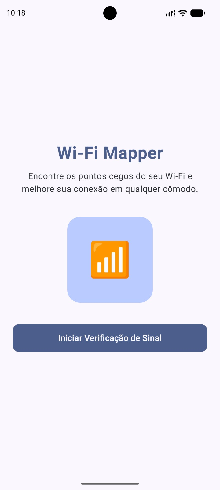

# SPRINT 01 — Definição do Produto e Primeira Tela

> **Disciplina:** Desenvolvimento de Software Móvel (2026.2)  
> **Equipe:** Team 03  
> **Integrantes:** Célia Hiromi (@hiromilly) e Geovanna Gaspar (@gegwspar)  
> **Ciclo de Desenvolvimento:** `SPEC → BUILD → VALIDATE → EXPLAIN → COMMIT`  
> **Prazo Oficial:** 14/09/2026  

---

## 1. Definição do Produto

- **Nome do Produto:** **Wi-Fi Mapper**
- **Declaração do Problema:**  
  Usuários domésticos, estudantes e profissionais em regime de *home office* frequentemente sofrem com quedas repentinas de conexão e lentidão durante chamadas de vídeo, reuniões ou transferências de arquivos, tendo dificuldade em diagnosticar se a falha decorre de sinal fraco em determinado cômodo ou de instabilidade externa do provedor de internet. Os aplicativos existentes no mercado para análise de rede são excessivamente técnicos, repletos de jargões complexos e sobrecarregados de anúncios intrusivos, tornando o diagnóstico inacessível para o usuário comum.
- **Público-Alvo:**  
  Estudantes, trabalhadores remotos, pequenos empreendedores e usuários domésticos que necessitam monitorar, entender e mapear a estabilidade da sua rede Wi-Fi residencial ou de trabalho de forma ágil, intuitiva e sem complexidades técnicas.
- **Objetivo do Produto:**  
  Prover uma solução móvel minimalista, clara e direta para verificar o status da rede Wi-Fi, acompanhar a intensidade do sinal em tempo real, mapear pontos de conexão por cômodo e orientar o usuário sobre a qualidade da sua conexão para tomada de decisões práticas.
- **Funcionalidades Iniciais Planejadas (Visão Semestral):**
  1. **Sprint 01 — Definição do Produto e Primeira Tela:** Identidade visual do Wi-Fi Mapper, apresentação do produto, slogan explicativo (*"Encontre os pontos cegos do seu Wi-Fi e melhore sua conexão em qualquer cômodo."*), elemento visual de sinal e botão de ação primária (*"Iniciar Verificação de Sinal"*).
  2. **Sprint 02 — Estado e Interação do Usuário:** Painel dinâmico com indicador reativo do nível de sinal (dBm / porcentagem / classificação qualitativa) e alternância interativa de estados de medição ao toque.
  3. **Sprint 03 — Navegação e Múltiplas Telas:** Estruturação da navegação entre tela principal (Dashboard), tela de detalhes da conexão Wi-Fi e tela de configurações/ajuda.
  4. **Sprint 04 — Entrada do Usuário, Formulários e Validação:** Formulário de cadastro de ambientes/cômodos para medição (ex: Quarto, Sala, Escritório) e parametrização de limites de sinal aceitável com validação de campos obrigatórios.
  5. **Sprint 05 — Persistência Local de Dados:** Armazenamento local com Room/SQLite para salvar o histórico de medições realizadas por ambiente com data/hora e nível de sinal registrado.
  6. **Sprint 06 — Integração com Dispositivo / APIs de Rede:** Leitura nativa de dados e métricas reais do adaptador Wi-Fi do Android (SSID, frequência 2.4/5 GHz, nível de RSSI em tempo real e status da rede).
  7. **Sprint 07 — Integração Final, Qualidade e Entrega:** Integração completa de todos os módulos, execução de testes de regressão, tratamento robusto de erros e permissões, polimento de UI/UX e entrega final da aplicação.

---

## 2. Especificação Técnica (SPEC-001)

A especificação técnica formal desta Sprint encontra-se documentada no arquivo:
- **Arquivo da Especificação:** [`docs/specs/SPEC-001.md`](docs/specs/SPEC-001.md)

### Requisitos Funcionais da Sprint 01:
- **RF-01 — Identidade Visual do Produto:** A tela inicial deve exibir o nome do aplicativo (**Wi-Fi Mapper**) com tipografia destacada (`fontSize = 32.sp`, `FontWeight.Bold`).
- **RF-02 — Slogan e Proposta de Valor:** A interface deve apresentar a mensagem concisa: *"Encontre os pontos cegos do seu Wi-Fi e melhore sua conexão em qualquer cômodo."*
- **RF-03 — Elemento Visual de Intensidade de Sinal:** A tela deve conter um card ilustrativo centralizado com cantos arredondados contendo o ícone visual com barras de intensidade de sinal Wi-Fi.
- **RF-04 — Botão de Ação Primária:** A interface deve disponibilizar um botão de destaque visual com o texto *"Iniciar Verificação de Sinal"*, com formato ergonômico e feedback visual de toque.

---

## 3. Implementação da Primeira Tela (Jetpack Compose)

A primeira tela foi desenvolvida integralmente com **Jetpack Compose** seguindo as diretrizes do Material Design 3 e arquitetura declarativa de UI.

- **Arquivo Principal:** `projects/team-03/app/app/src/main/java/com/teamxx/teste/MainActivity.kt`
- **Componentes Utilizados:**
  - `Scaffold`: Estrutura base da tela com suporte a padding de bordas seguras (*edge-to-edge*).
  - `Column`: Organização vertical dos elementos com centralização horizontal (`Alignment.CenterHorizontally`) e distribuição equilibrada (`Arrangement.SpaceEvenly`).
  - `Box`: Utilizado com `clip(RoundedCornerShape(...))` e `background()` para criar o container visual arredondado e as barras do indicador de sinal.
  - `Row`: Distribuição alinhada na base das barras de sinal com espaçamento proporcional.
  - `Text`: Hierarquia tipográfica com peso visual destacado para o título e slogan com bom contraste e legibilidade.
  - `Button`: Botão primário customizado com cantos arredondados de `12.dp` e altura de `56.dp`.
  - `Modifier`: Aplicação de `fillMaxSize()`, `fillMaxWidth()` e `padding()` garantindo responsividade em qualquer densidade de tela.

---

## 4. Validação e Evidência

- **Caminho da Evidência:** `evidence/sprint-01/first-screen.png`
- **Visualização da Tela:**

---

## 5. Critérios de Aceitação da Sprint 01

- [x] **AC-01** — Nome do produto, problema real, público-alvo e objetivo documentados.
- [x] **AC-02** — Arquivo `SPEC-001.md` criado na pasta `docs/specs/`.
- [x] **AC-03** — A especificação contém requisitos funcionais e critérios de aceitação mensuráveis.
- [x] **AC-04** — A primeira tela foi desenvolvida integralmente com Jetpack Compose.
- [x] **AC-05** — O nome do aplicativo (**Wi-Fi Mapper**) está claramente visível na tela.
- [x] **AC-06** — O slogan explicativo está legível e bem posicionado.
- [x] **AC-07** — O botão de ação primária está presente e visualmente destacado.
- [x] **AC-08** — O aplicativo compila com sucesso (`BUILD SUCCESSFUL`).
- [x] **AC-09** — O aplicativo executa sem travamentos ou falhas inesperadas (*no crash*).
- [x] **AC-10** — A tela construída reflete fielmente o que foi especificado na SPEC-001.
- [x] **AC-11** — Ambas as integrantes da equipe compreendem e conseguem explicar o código e componentes utilizados.

---

## 6. Registro de Uso de Inteligência Artificial (LLM)

Em conformidade com as diretrizes de integridade e auditoria da disciplina, o uso de ferramentas de IA foi estruturado e supervisionado conforme a tabela abaixo:

| Item | Resposta da Equipe |
| :--- | :--- |
| **LLM / Ferramenta utilizada** | Antigravity AI / Gemini 3.7 Flash |
| **Tarefa apoiada pela IA** | Estruturação da declaração de problema centrado no usuário, refinamento dos requisitos funcionais (RF) da SPEC-001 e arquitetura declarativa da primeira tela em Jetpack Compose. |
| **Principal sugestão recebida** | Criação de um card central ilustrativo com barras de intensidade e botão de ação primária com `Modifier.fillMaxWidth()` e `Arrangement.SpaceEvenly`. |
| **O que a equipe alterou manualmente** | Adequação dos textos e termos para o contexto do **Wi-Fi Mapper**, calibração do layout visual com o protótipo real, ajuste de espaçamentos e teste no emulador Android. |
| **Como o resultado foi validado** | Revisão linha a linha do código, verificação estática do layout e validação no emulador Pixel com API 34. |

---

## 7. Informações de Submissão Git

- **Branch da Sprint:** `team-03/sprint-01`
- **Padrão Semântico de Commits:**
  - `docs: define SPEC-001 and product goals for Wi-Fi Mapper`
  - `feat: implement welcome screen using Jetpack Compose`
  - `docs: add sprint 01 report and visual evidence`
- **Título do Pull Request:** `[Sprint 01] Team 03 — Product Definition & First Screen`
- **Repositório Base:** `brenofeliix/mobile-development-2026-2` (branch `main`)
- **Repositório de Origem (Fork):** `hiromilly/mobile-development-2026-2` (branch `team-03/sprint-01`)

---

## 8. Checklist de Definição de Pronto (Definition of Done)

- [x] Conceito do produto e declaração do problema documentados.
- [x] `SPEC-001.md` completa e consistente.
- [x] Primeira tela implementada em Jetpack Compose.
- [x] Compilação e execução validadas.
- [x] Evidência visual organizada na pasta `evidence/sprint-01/first-screen.png`.
- [x] Uso de IA documentado com integridade.
- [x] Branch e Pull Request configurados de acordo com o padrão do curso.
