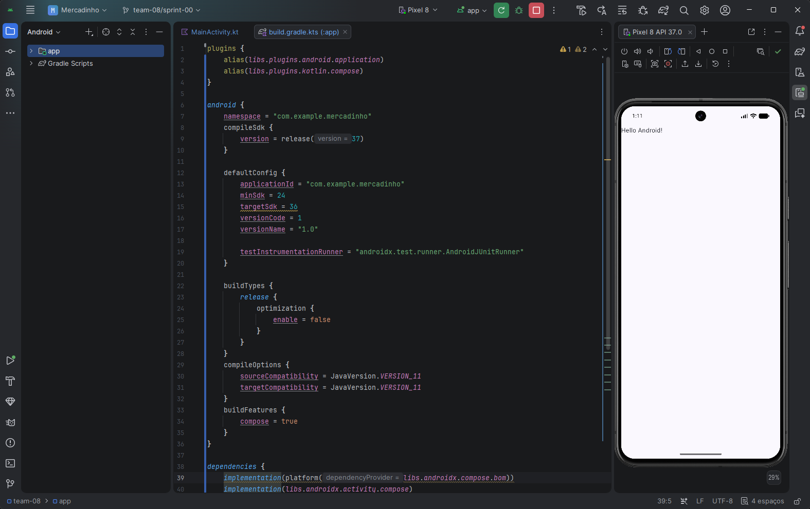

# Team 08 — SPRINT 00

## Team Information
* **Número da equipe:** Team 08
* **Membro da equipe::** 
* Ítalo Huan (@itimt)
* Rayse Kawane (@Rays3107)

## Development Environment Status
* **Git Configuration:** Configured & operational (AC-02)
* **Course Repository Forked:** Forked to team workspace (AC-03)
* **Sprint Branch:** `team-08/sprint-00` created (AC-04)
* **Android Studio:** Installed & configured (AC-05)
* **Android SDK:** Configured (Target API 37 / Android 16+) (AC-06)
* **Android Emulator:** Pixel 8 (API 37, x86_64, 2GB RAM, Google APIs) - Configured and running (AC-07)
* **Application Status:** Kotlin + Jetpack Compose app created, builds successfully (AC-08) and runs without crashing (AC-09)

## Dificuldades encontradas
- *Alta lentidão na máquina da UNEMAT, pelo emulador consumir muita memoria.

## Evidencia de aplicativo Android

